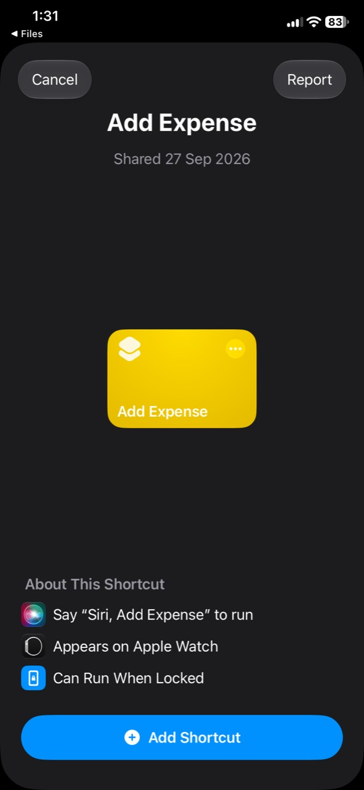
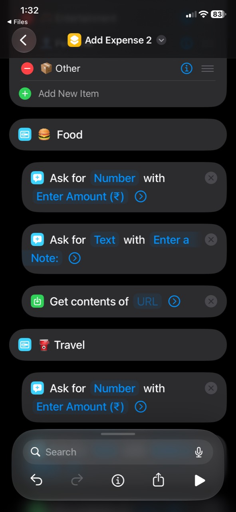
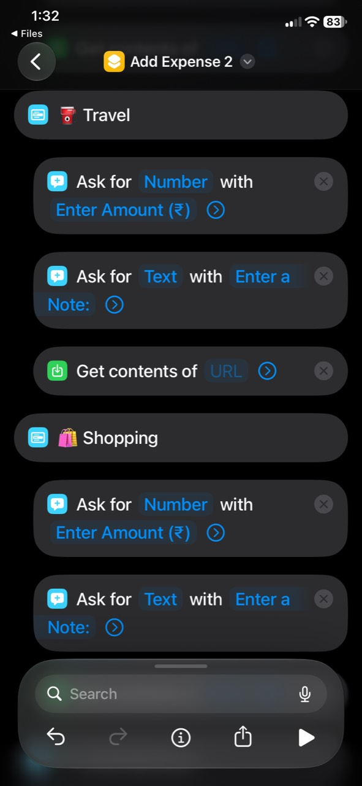
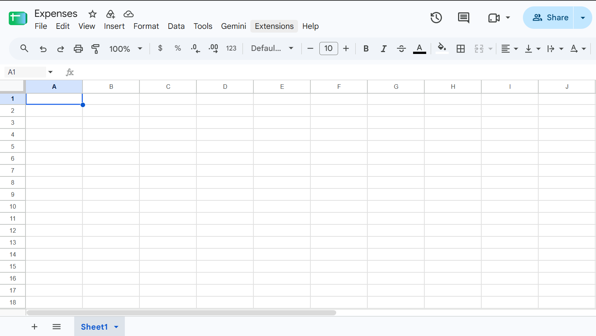
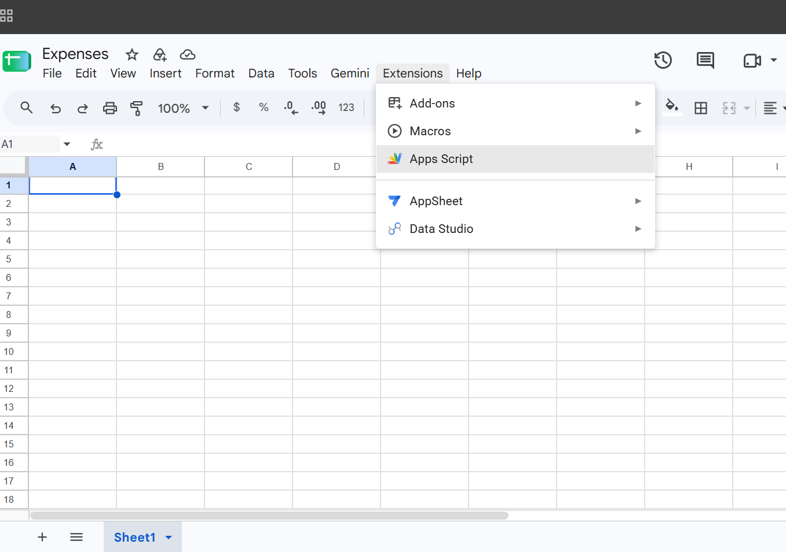
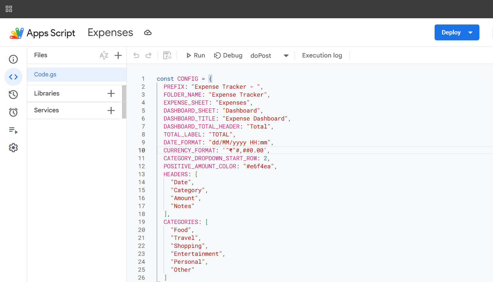
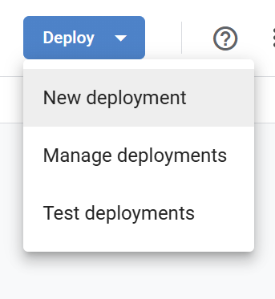
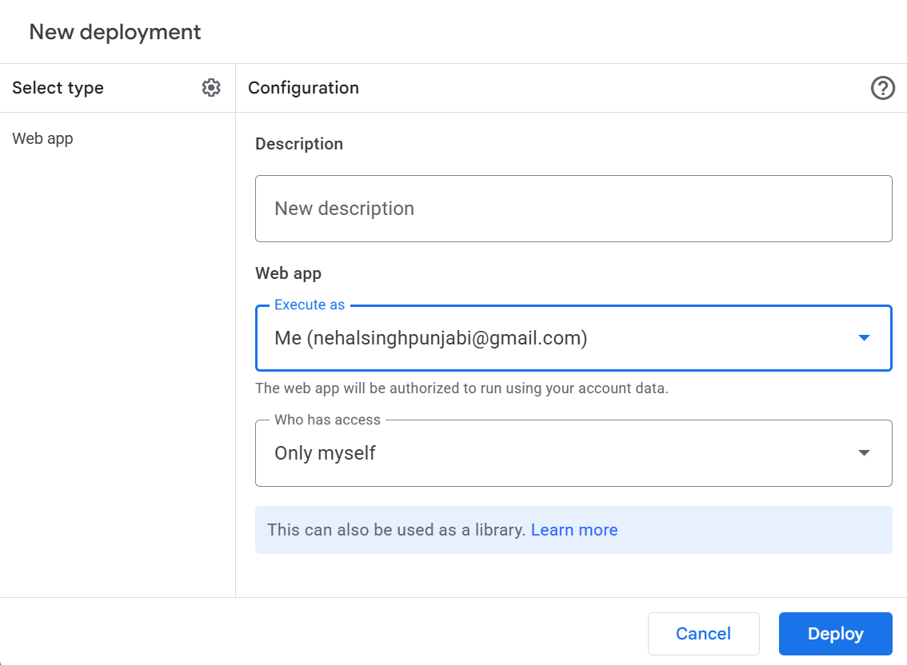
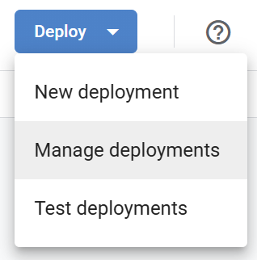
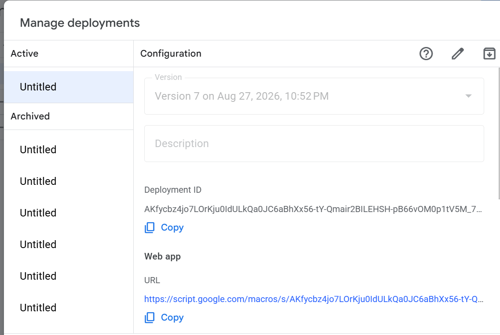

# Free Expense Tracker: Google Sheets + iPhone Shortcuts

Track expenses from an iPhone Shortcut with a free Google Sheets back end. This project uses Google Apps Script (included as `Code.gs`) to create one spreadsheet per month, store the expenses, and build a category dashboard automatically.

## Main iPhone component

[`Add Expense V2.shortcut`](Add%20Expense%20V2.shortcut) is the ready-to-import iPhone Shortcut supplied with this project.

1. Download the file on your iPhone and open it.
2. On the preview screen, tap **Add Shortcut**.

   

3. Open the added shortcut in the Shortcuts app. In every category section, tap the **Get Contents of URL** node and paste the Web App URL from your own Apps Script deployment.

   

4. Use the same Web App URL in every **Get Contents of URL** node, then run the shortcut to test it.

   

Do this URL setup only after adding the downloaded file as a shortcut.

## What it creates

The first expense in a month creates an **Expense Tracker** folder in Google Drive and a spreadsheet named `Expense Tracker - Month Year`. Each monthly spreadsheet includes:

- **Expenses** — Date, Category, Amount, and Notes.
- **Dashboard** — Category totals and a monthly total.

Categories are Food, Travel, Shopping, Entertainment, Personal, and Other. Currency is formatted as Indian rupees.

## You need

- A Google account
- A laptop or desktop browser (Google Sheets and Apps Script setup)
- An iPhone with the Shortcuts app

No paid service, API key, or add-on is needed.

## 1. Create the Google Apps Script project

1. On your laptop, open [Google Sheets](https://sheets.new) and give the blank spreadsheet any name, such as **Expenses**.

   

2. Select **Extensions → Apps Script**.

   

3. In the file named `Code.gs`, delete the sample code.
4. Copy everything from this repository's [`Code.gs`](Code.gs) file and paste it into the editor.

   

5. Save the project.

The blank spreadsheet is only used to host the Apps Script project. The script creates the monthly expense spreadsheets itself after it receives the first request.

## 2. Deploy it as a web app

1. In Apps Script, select **Deploy → New deployment**.

   

2. Click the gear beside **Select type** and choose **Web app**.
3. Leave **Execute as** set to **Me**.
4. Under **Who has access**, choose **Anyone**. Do not use **Only myself**: Shortcuts will not be able to add expenses without Google sign-in.

   

5. Click **Deploy** and complete Google's authorization prompts.
6. Copy the **Web app URL** that Apps Script shows. You can find it again at **Deploy → Manage deployments**.

   

   

Keep this URL private. Anyone who has it can submit expenses to this tracker.

## 3. Build the iPhone Shortcut

Make one menu option (or one shortcut) for each category. In each branch, use these actions:

1. **Ask for Input** — prompt: `Amount`; input type: Number.
2. **Ask for Input** — prompt: `Note`; input type: Text (optional).
3. **Dictionary** — add the following values:

   | Key | Value |
   | --- | --- |
   | `category` | The branch category, for example `Food` |
   | `amount` | The Amount result from the first Ask for Input action |
   | `note` | The Note result from the second Ask for Input action |

4. **Get Contents of URL** — paste the Web app URL. Set Method to **POST** and Request Body to **JSON**, then select the Dictionary as its JSON body.
5. Optional: add **Show Result** after it to display the response.

Repeat the **Get Contents of URL** action in every menu branch if your Shortcut has separate category nodes, using the same Web app URL each time. The included [`Add Expense V2.shortcut`](Add%20Expense%20V2.shortcut) is the starting point for this setup.

Example request body:

```json
{
  "category": "Food",
  "amount": 250,
  "note": "Lunch"
}
```

## Test it

Run the Shortcut once with a valid category. A successful response contains `"success": true`. Open Google Drive → **Expense Tracker** to see the new monthly spreadsheet and dashboard.

## Updating the code later

After editing `Code.gs` in Apps Script:

1. Save the script.
2. Go to **Deploy → Manage deployments**.
3. Edit the active deployment, select a new version, and deploy it.

Your web app URL should stay the same when you update the existing deployment.

## Troubleshooting

- **"Request body is missing"**: Set **Get Contents of URL** to POST with a JSON request body.
- **"Category is not supported"**: Use exactly one of the six categories listed above.
- **Shortcut cannot reach the script**: Check deployment access; it must allow the Shortcut's request.
- **No sheet appears**: Run the Shortcut once, then check Google Drive for the **Expense Tracker** folder.

## Privacy

This is a personal tracker. The deployment URL is the write endpoint, so do not post it publicly. Anyone with the URL can submit entries, though they cannot directly browse your Drive through it.
